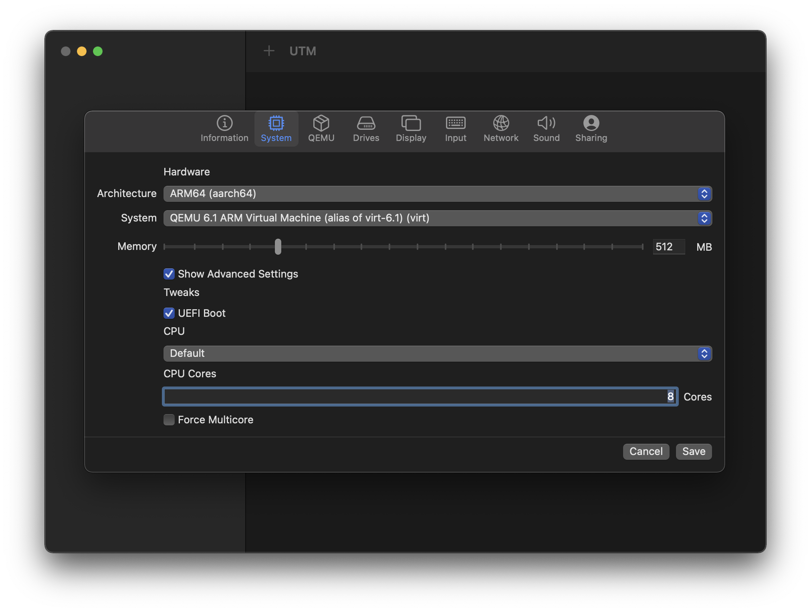

# arm64 Arch Linux

## Prerequisites

Either [build your own arm64 Arch
ISO](https://github.com/JackMyers001/archiso-aarch64) or download a [pre-made
image](https://github.com/JackMyers001/archiso-aarch64/releases).

## UTM configuration

Launch UTM, and tap on the + symbol, followed by the "Start from Scratch" box:

On the "Information" tab, specify a name.

Optional: specify the style as "Operating System", scroll down, and click on the
monitor icon to bring up your icon of choice.

On the "System" tab, change the following options from their defaults:

| Item name | Item value | Comment |
| --------- | ---------- | ------- |
| Architecture | ARM64 (aarch64) | |
| Show Advanced Settings | ☑️ | |
| CPU | Default | |
| CPU Cores | 8 | will vary based on your physical hardware, e.g. maybe the M1 Max can go up to 10 |

On the "Drives" tab, mount the previous ISO by tapping "Import Drive", and
navigating to it:

Still on the "Drives" tab, tap on "New Drive" and specify a sensible size for
your main hard disk, keeping the interface as VirtIO:

On the "Display" tab, move from "Full Graphics" to "Console Only".

On the "Sound" tab, uncheck "Enabled":

Tap "Save" to exit back to the main UTM screen, and press the ▶️ button to start
the new VM you've just configured.

## On-target configuration

Log in with the user `root`, resize the console by pressing the button below,
and follow the [Arch Installation
guide](https://wiki.archlinux.org/title/installation_guide) until the "Boot
loader" phase.

> Note: the console window supports copy & paste

Here are some (optional) tips that I think are helpful for a new install:

  * enable [parallel `pacman`
  downloads](https://wiki.archlinux.org/title/Pacman#Enabling_parallel_downloads)
  * `pacstrap` these packages (includes the defaults): `acpi base base-devel
    bind bwm-ng ctags docker fd flake8 fzf gdb git go htop inetutils iotop jq
    linux linux-firmware lsof man-db moreutils mtr ncdu neofetch nfs-utils nmap
    openssh pacman-contrib pass python python-jinja python-pip
    python-virtualenvwrapper python-yaml ripgrep rsync s3cmd sipcalc strace
    tcpdump tmux unzip vim whois yamllint zsh`

### Boot loader

Once at the "Boot loader" section, choose an [appropriate
one](https://wiki.archlinux.org/title/Arch_boot_process#Boot_loader) and follow
its install steps. This guide opts for `systemd-boot` for simplicity.

Follow the [`systemd-boot` installation
guide](https://wiki.archlinux.org/title/Systemd-boot#Installation), up until the
"Loader configuration" section.

Specify a single Arch target by replacing `/boot/loader/loader.conf` with:

    default arch.conf
    timeout 0
    console-mode auto

Get the root partition's UUID by matching it against:

    ls -la /dev/disk/by-uuid/

And define the Arch target by adding this into `/boot/loader/entries/arch.conf`:

    title   Arch Linux
    # note: not /vmlinuz-linux
    linux   /Image
    initrd  /initramfs-linux.img
    options root="UUID=<UUID_FROM_EARLIER>" rw

## Optional on-target configuration

### Match user/group ids between host and guest operating systems

If you plan on using NFS shares to link the inside of your VM with your host OS,
it's advantageous to match uids and gids. Find out your host OS user's uid and
gid by typing the following in a terminal outside of UTM:

    id | tr ' ' '\n'

You should see output similar to the below, showing a uid of 501 and a gid of
20:

    uid=501(ahrex)
    gid=20(staff)
    ...

We can match an existing group in the guest OS to the gid of `staff`. Since
there is no `staff` group in Arch, we'll substitute with `users` instead. Run
the following in the UTM console window:

    groupmod --gid 20 users

### Non-root user

It's generally not recommended to use the root account for day-to-day
operations.  Create a non-root user by running the following, replacing
`<USERNAME>` as appropriate:

    useradd --gid users --groups wheel --create-home --shell /bin/zsh --uid 501 <USERNAME>

The uid of `501` should match what was found in the previous section. Feel free
to omit other parts as needed.

We can also grant the `wheel` group sudo access by running `visudo` and
uncommenting the following line:

    # %wheel ALL=(ALL) NOPASSWD: ALL

This allows us to have a non-administrator user for general operations, while
giving us the ability to escalate to the root user as needed.

The `NOPASSWD` argument is useful if you don't set a password on your day to day
user, since there will be no way to enter a correct password when one is not
set.

### Automatic console login

If you opt to not store a password for your user, you'll either need to `ssh` in
using an `authorized_key` entry, or log in passwordless via `getty`. To enable
[passwordless console
login](https://wiki.archlinux.org/title/getty#Serial_console), run the following
commands, replacing `<USERNAME>` as appropriate:

    mkdir /etc/systemd/system/serial-getty\@ttyAMA0.service.d
    echo '[Service]' > /etc/systemd/system/serial-getty\@ttyAMA0.service.d/autologin.conf
    echo 'ExecStart=' >> /etc/systemd/system/serial-getty\@ttyAMA0.service.d/autologin.conf
    echo 'ExecStart=-/usr/bin/agetty --autologin <USERNAME> -s %I 115200,38400,9600 vt102' >> /etc/systemd/system/serial-getty\@ttyAMA0.service.d/autologin.conf

### DHCP networking using `systemd-networkd`

Get the default route by noting what comes after `dev` in this command:

    ip route get 1.1.1.1

It should be of the form `enpXsY`. Create a network config similar to the [Arch
guide](https://wiki.archlinux.org/title/systemd-networkd#Wired_adapter_using_DHCP)
by writing the following to `/etc/systemd/network/20-wired.network`:

    [Match]
    Name=enpXsY

    [Network]
    DHCP=yes

And enabling `systemd-networkd`:

    systemctl enable systemd-networkd.service

### Default DNS resolvers

To use the resolvers provided by UTM, simply enable `systemd-resolved`:

    systemctl enable systemd-resolved.service

### SSH server

While the console window is pretty functional, sometimes you want to be able to
ssh in, or scp files around. Enable `sshd` by running:

    systemctl enable sshd.service

## Testing it all out

Exit the installation by leaving the chroot an unmounting our install disk:

    exit
    umount -R /mnt

And shut down the VM:

    shutdown -h now

In the main UTM window, tap on your newly-created VM, and then tap on the "Edit
selected VM" button:

On the "Drives" tab, delete the install ISO:

Save, and try running the guest OS in mission mode!

## Final touches

You'll probably want to add your ssh pubkeys, as well as figure out a static IP
scenario for the guest VM.
